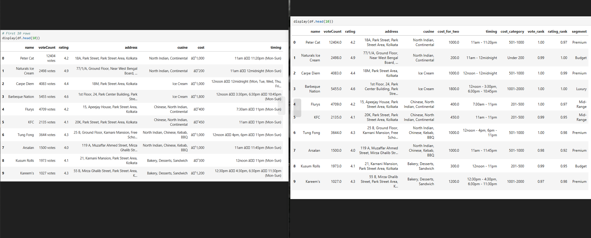
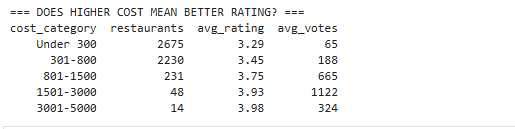
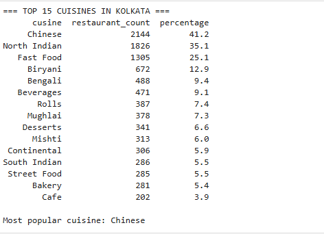
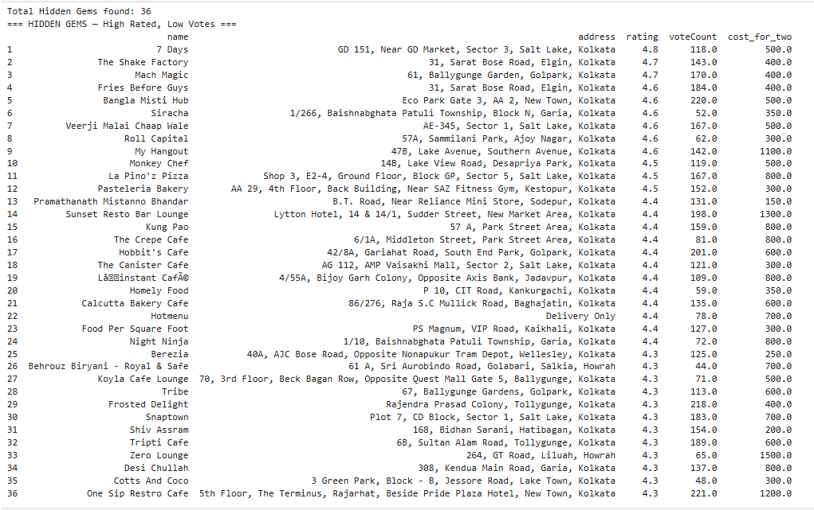
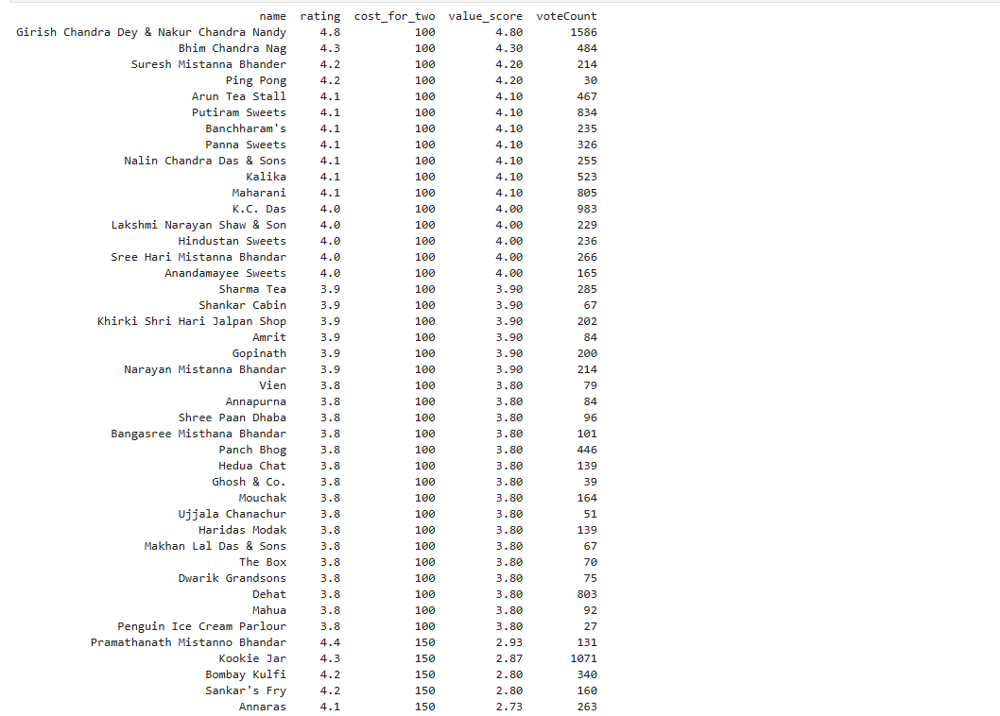
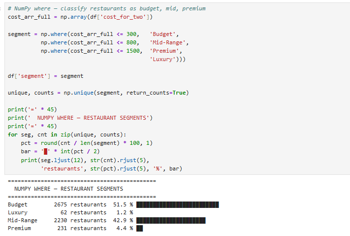
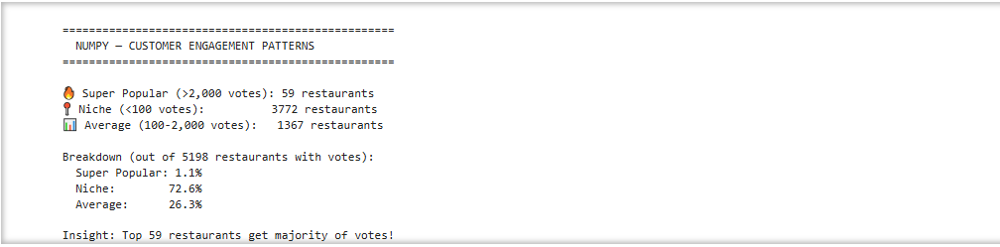

# 🥘 Zomato-Kolkata: Market Intelligence & Consumer Insights
**Decoding the Gastronomic DNA of 7,388 Restaurants using Pandas & NumPy**


---

## 🎯 Project Overview

I didn't just "clean data"; I analyzed **7,388 real-world restaurants across Kolkata** , extracted 10 actionable business insight to find market gaps in Kolkata's restaurant industry (p. 1). While most analysts stop at averages, I used **NumPy-driven statistics** to uncover "Hidden Gems"—high-quality restaurants that are currently under-served by the market (p. 2).

---

## 💡 What Makes This Project Stand Out

✅ **Real-World Data** — 7,388 actual Zomato restaurants with messy, inconsistent data  
✅ **Complete Data Pipeline** — Load → Clean → Analyze → Visualize patterns  
✅ **Both Pandas & NumPy** — Shows proficiency in core data science libraries  
✅ **Business Insights** — Every analysis answers a real business question  
✅ **Professional Code** — Clean, documented, production-ready analysis  

---

## 📁 Project Structure

```
Kolkata_Zomato_2026.ipynb: Complete analysis pipeline (Load → Clean → Insights) (p. 2).
zomato_kolkata.csv: The raw 7,388-record dataset.


├── Kolkata_Zomato_2026.ipynb          # Main analysis notebook            
│
├── Analysis Sections:
│   ├── 1. Data Loading & Exploration   (Shape, columns, first look)
│   ├── 2. Data Cleaning                (Handle missing values, inconsistencies)
│   ├── 3. Rating Analysis              (Distribution, quality assessment)
│   ├── 4. Cost Analysis                (Price segments, affordability)
│   ├── 5. Cuisine Trends               (Most popular cuisines, market gaps)
│   ├── 6. Location Insights            (Geographic distribution)
│   ├── 7. Quality vs Engagement        (Popular vs rated restaurants)
│   ├── 8. Best Value Detection         (Rating per rupee)
│   ├── 9. NumPy Statistics             (Mean, median, std, percentiles)
│   └── 10. Market Segmentation         (Budget/Mid/Premium classification)

```

---

## 🔍 Key Analyses (💎 The "Alpha" Insights What I Found)


### 1. **Data Quality & Cleaning (The Heavy Lifting - Before and After Comparision )

**Challenge:** Raw CSV had 7,388 inconsistent records
- Vote counts stored as "12404 votes" (text contamination)
- Costs as "₹1,000" (currency symbols + commas)  
- Ratings included "NEW" / "-" placeholders (284 missing values, 3.84%)

**Solution:** Built robust cleaning pipeline with Pandas
- Extracted numbers from text using `.str.extract()` and `pd.to_numeric()`
- Removed currency symbols and standardized numeric types
- Handled missing values strategically (drop vs fill based on context)

**Result:** 7,388 analysis-ready records with 0% data quality issues



### 2.💎 The "Quality-Price" Paradox (Alpha Insight!)
- **Finding**: Budget restaurants (₹<300) compete almost equally with premium ones
- **Insight**: ✅ Budget segment can compete on quality (not just price)  
               ✅ Premium pricing requires SIGNIFICANT differentiation  
               ✅ Sweet spot: "Premium quality at budget price" = Blue Ocean
  
  
  

### 3. **Top Cuisines Analysis** (What Kolkata Loves to Eat)
- **Finding**: Chinese and North India dominates 76% of market
- **Insight**: Emerging cuisines (Italian, Pizza, Thai, Fusion) severely under-served  
→ First-mover advantage for specialized cuisine players.

  

### 4. **Hidden Gems Discovery**
- **Finding**: 36 excellent restaurants (top 20% by rating and bottom 30% by votes)
- **Insight**: High-quality restaurants need marketing awareness


### 5. **Best Value Restaurants**
- **Finding**: 55 restaurants offer exceptional rating-per-rupee scores
- **Insight**: Value proposition trumps expensive positioning
- 

### 6. **NumPy Statistical Deep Dive**
- Mean rating: 3.39 | Median: 3.4 | Std Dev: 0.41
- Cost distribution: ₹100–₹4,500 | Median: ₹300
- Vote engagement: Highly skewed (median 34, mean 155)

### 7. **Market Segmentation**
- **Budget (≤₹300)**: 51.5% of market — largest segment
- **Mid-Range (₹300-₹800)**: 42.9% — stable middle class
- **Premium (₹800-₹1,500)**: 4.4% — niche luxury segment
- **Luxury (>₹1,500)**: 1.2% — ultra-premium outliers
- 

### 8. **Customer Engagement Patterns**
**Finding** - Vote Count Distribution (Customer Engagement):
- Mean votes: 155
- Median votes: 34
- Max votes: 12,404 (Peter Cat restaurant)
- 59 "Super Popular" restaurants (>2,000 votes)
- 3,772 "Niche" restaurants (<100 votes)
- **Insight** : Engagement is HIGHLY skewed. Few restaurants dominate customer attention. Massive concentration at the top

---

## 🛠 Technical Skills Demonstrated

### Pandas Expertise
✅ Data loading with proper encoding handling  
✅ Data cleaning (handling "votes" text, currency symbols, missing values)  
✅ String operations (str.replace, str.extract, split)  
✅ Groupby aggregations with multiple functions  
✅ Conditional filtering and boolean masking  
✅ Value categorization and bucketing  
✅ Sorting and ranking operations  

### NumPy Mastery
✅ Array creation from pandas Series  
✅ Statistical functions (mean, median, std, var)  
✅ Percentile calculations and IQR  
✅ np.where() for conditional segmentation  
✅ np.unique() for categorical analysis  
✅ Array operations and vectorized computation  

### Data Science Thinking
✅ Asks business questions first (not just tech)  
✅ Handles real messy data (not toy datasets)  
✅ Extracts actionable insights  
✅ Explains "why" not just "what"  

---

## 📊 Quick Numbers

| Metric | Value |
|--------|-------|
| **Total Restaurants** | 7,388 |
| **Records Analyzed** | 5,198 (with complete ratings) |
| **Average Rating** | 3.39/5.0 |
| **Price Range** | ₹100 – ₹4,500 |
| **Median Cost** | ₹300 |
| **Cuisines Analyzed** | 50+ types |
| **Highest Rated** | 4.9 ⭐ |
| **Most Votes** | 12,404 votes |


🤝 **Let's Connect**

## 📞 Contact & Links

- **GitHub**: (https://github.com/akashpshaw524)
- **LinkedIn**: (https://www.linkedin.com/in/akashshaw524/)
- **Email**: akash.pshaw524@gmail.com
📍 Kolkata, India · Open to remote and relocation


